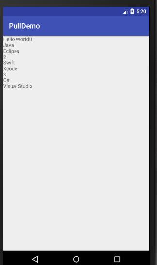

# PullDemo
Android studio 解析assets下面的XML文件
# language.xml 文件详细请看assets下
<pre><code>

import java.io.IOException;  
import java.io.InputStream;  
import javax.xml.parsers.DocumentBuilder;  
import javax.xml.parsers.DocumentBuilderFactory;  
import javax.xml.parsers.ParserConfigurationException;  
import org.w3c.dom.Document;  
import org.w3c.dom.Element;  
import org.w3c.dom.NodeList;  
import org.xml.sax.SAXException;  
import android.app.Activity;  
import android.os.Bundle;  
import android.widget.TextView;  
  
public class MainActivity extends Activity {  
      
    private TextView tv_show;  
    @Override  
    protected void onCreate(Bundle savedInstanceState) {  
        super.onCreate(savedInstanceState);  
        setContentView(R.layout.activity_main);  
        tv_show = (TextView) findViewById(R.id.tv_show);  
          
        try {  
            //传入文件名：language.xml；用来获取流  
            InputStream is = getAssets().open("language.xml");  
            //首先创造：DocumentBuilderFactory对象  
            DocumentBuilderFactory dBuilderFactory = DocumentBuilderFactory.newInstance();  
            //获取：DocumentBuilder对象  
            DocumentBuilder dBuilder = dBuilderFactory.newDocumentBuilder();  
            //将数据源转换成：document 对象  
            Document document = dBuilder.parse(is);  
            //获取根元素  
            Element element = (Element) document.getDocumentElement();  
            //获取子对象的数值 读取lan标签的内容  
            NodeList nodeList = element.getElementsByTagName("lan");  
            for (int i = 0; i < nodeList.getLength(); i++) {  
                //获取对应的对象  
                Element lan = (Element) nodeList.item(i);  
                //lan.getAttribute("id") 获取id的值  
                tv_show.append(lan.getAttribute("id")+"\n");  
                //获取name标签下的内容  
                tv_show.append(lan.getElementsByTagName("name").item(0).getTextContent()+"\n");  
                //获取ide标签下的内容  
                tv_show.append(lan.getElementsByTagName("ide").item(0).getTextContent()+"\n");  
            }  
              
        } catch (IOException e) {  
            e.printStackTrace();  
        } catch (ParserConfigurationException e) {  
            e.printStackTrace();  
        } catch (SAXException e) {  
            e.printStackTrace();  
        }  
    }  
}  

</code></pre>

# 运行效果

  
